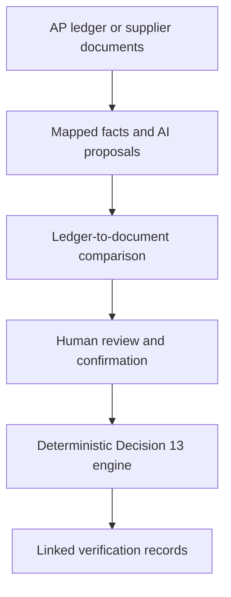

<div align="center">

# FTA13 Verification Engine

**Portfolio screening and document-assisted verification for UAE FTA Decision No. 13 of 2026**

[](https://www.python.org/)
[](.github/workflows/ci.yml)
[](.github/workflows/ci.yml)
[](LICENSE)

[**Open the live tool**](https://fta13-uae-input-tax-verification.streamlit.app/) · [How it works](#how-it-works) · [Run locally](#run-locally) · [Legal source](#legal-source-and-scope)

</div>

---

## What this tool does

FTA13 turns the verification measures in UAE Federal Tax Authority Decision No. 13 of 2026 into a guided, explainable workflow.

Users can:

- upload a transaction-level AP ledger and rank an entire supplier portfolio;
- quantify input VAT in the population requiring review (a screening measure,
  not a recoverability conclusion);
- upload Arabic, English, or bilingual supplier documents;
- select a ranked ledger supplier and reconcile uploaded documents to it using
  legal name, TRN, invoice reference, date and amount;
- use AI to propose invoice and supplier fields with page-level source quotations;
- review and correct every proposed field before relying on it;
- evaluate the AED 10,000, AED 100,000, and AED 375,000 thresholds;
- identify the supplier and supply checks applicable to the transaction;
- record documentary evidence and named human conclusions;
- distinguish uploaded-and-hashed evidence from documents only confirmed as held;
- download a professional PDF report, CSV register, and JSON audit record; and
- optionally sign in to save an assessment and its documents privately.

Assessment, document reading, and report downloads do not require an account. Sign-in appears only under **Save for later**.

Portfolio screening is session-only and does not save the uploaded ledger. The
CSV mapper requires the internal supplier reference, supply reference, supply
date, and amount excluding VAT. **Supplier names and TRNs are optional:** a team
can screen its full portfolio using internal codes and financial data only.
Supplier legal name and TRN are recommended only when the team wants to connect
supplier documents to the selected internal ledger record.
Input VAT, expected next-12-month spend, and last verification date are optional.
Dates use `YYYY-MM-DD` and amounts use AED.

The internal supplier reference is used only to group the AP ledger; it is not
expected to appear on supplier documents. After a ranked supplier is selected,
the app compares the extracted legal name and TRN at supplier level, then the
invoice reference, date and amount at transaction level. The proposed linkage
must be confirmed by a named reviewer before PDF, CSV or JSON exports are enabled.

### Synthetic launch demonstration

Screened as at 1 October 2026, the included 800-supplier dataset produces 151
enhanced-check priorities, 258 full-verification priorities and AED 7.80 million
of input VAT screening exposure. It also deliberately includes 12 suppliers
with sub-AED 10,000 invoices before crossing AED 100,000, 12 suppliers due for
re-verification within 90 days and a separate overdue population. These are
synthetic screening results, not input-tax recoverability conclusions.

Each assessment accepts up to five supporting documents of no more than 5 MB
each, and they must relate to one supplier and one supply/invoice. The app
compares supplier names, TRNs and invoice references document by document and
blocks conflicting batches before fields are merged.

## Why the thresholds matter

| Decision rule | Workflow effect |
|---|---|
| Supply is below **AED 10,000** | The Article 6(1) exception may be available |
| Prior or expected 12-month supplier spend **exceeds AED 100,000** | The AED 10,000 exception is withdrawn |
| Prior or expected 12-month supplier spend **exceeds AED 375,000** | Enhanced supplier checks apply |

A small invoice is not automatically exempt. For example, an AED 2,400 invoice can require the full workflow when prior or expected supplier spend exceeds AED 100,000.

## How it works



The control boundary is intentional:

- AI reads documents and proposes structured facts. It does not decide compliance.
- AI evidence matches appear only as hints; a person must still confirm each
  blocking document-evidence checkbox.
- A confirmed uploaded document is content-addressed with SHA-256; a checkbox
  without a matching upload is clearly reported as self-attested.
- The AI never invents an ERP supplier code. A user selects the ledger supplier,
  and deterministic comparisons propose the document linkage for human confirmation.
- A person reviews AI-populated fields and signs judgment-based conclusions.
- The deterministic engine applies thresholds and clause logic reproducibly.
- The report records the result and supporting gaps; it does not determine overall input-tax recoverability.

## Outputs

| Output | Intended use |
|---|---|
| Ranked portfolio CSV | Supplier prioritisation, threshold monitoring, re-verification queue, and screening exposure |
| PDF verification report | Readable review and sign-off record, with Arabic text support |
| CSV verification register | Finance, tax, or audit register |
| JSON audit record | System integration and reproducible storage |
| Optional private workspace | User-owned assessments and uploaded evidence |

## Run locally

```bash
git clone https://github.com/Chezhira/fta13-uae-input-tax-verification.git
cd fta13-uae-input-tax-verification
python -m venv .venv
```

Activate the environment:

```bash
# Windows PowerShell
.venv\Scripts\Activate.ps1

# macOS or Linux
source .venv/bin/activate
```

Install and start the app:

```bash
pip install -r requirements.txt
streamlit run app.py
```

The manual workflow works without external credentials. AI document extraction requires an OpenAI API key. Private saving additionally requires Supabase configuration.

When AI extraction is used, uploaded supplier documents are transmitted to
OpenAI for processing after the user gives explicit authorisation. Requests use
`store=False`, but users should still apply their organisation's privacy,
confidentiality, retention, and cross-border data-transfer requirements before
uploading documents.

## Configuration

Copy `.streamlit/secrets.toml.example` to `.streamlit/secrets.toml`:

```toml
OPENAI_API_KEY = ""
OPENAI_EXTRACTION_MODEL = "gpt-5.6"
FTA13_RULESET = "fta13 0.2.1"
SUPABASE_URL = ""
SUPABASE_ANON_KEY = ""
```

For private saving:

1. Run [`supabase/migrations/001_initial.sql`](supabase/migrations/001_initial.sql) in the Supabase SQL editor.
2. Configure the Supabase email template to include `{{ .Token }}` for email OTP sign-in.
3. Use only the anonymous key in the app. Never expose a service-role key.

## Project structure

| Path | Purpose |
|---|---|
| `fta13/thresholds.py` | Exact threshold and rolling-period calculations |
| `fta13/portfolio.py` | AP-ledger validation, grouping, ranking, and exposure screening |
| `fta13/linkage.py` | Deterministic comparisons between ledger rows and extracted documents |
| `fta13/clauses.py` | Decision requirements expressed as data |
| `fta13/engine.py` | Deterministic supplier and supply evaluation |
| `fta13/extraction.py` | Arabic and English document extraction schema |
| `fta13/reporting.py` | PDF report generation and Arabic rendering |
| `fta13/storage.py` | Authenticated Supabase persistence |
| `fta13/ai.py` | Separate, optional advisory drafting for judgment clauses |
| `app.py` | Streamlit user workflow |
| `.streamlit/config.toml` | Streamlit upload limit and telemetry setting |
| `supabase/migrations/` | Database, row-level security, and private storage setup |
| `tests/` | Boundary, extraction, reporting, and control tests |
| `docs/legal-sources/` | Authoritative Arabic Decision and reconciliation record |
| `examples/fta13_synthetic_portfolio_800.csv` | Upload-ready synthetic launch dataset (800 suppliers) |
| `examples/fta13_synthetic_portfolio_800.xlsx` | Formatted synthetic dataset, dictionary, and validation checks |

## Test the project

```bash
pip install -e ".[dev]"
python -m pytest -q
python demo.py
```

GitHub Actions runs the suite on Python 3.10, 3.11, and 3.12 and enforces at least 90% coverage across the tested `fta13` modules.

## Legal source and scope

The implementation has been reconciled to the authoritative Arabic Decision. English labels are based on the FTA's unofficial English translation.

- [Authoritative Arabic Decision](docs/legal-sources/FTA-Decision-13-2026-Arabic.pdf)
- [Arabic-to-implementation reconciliation](docs/legal-sources/RECONCILIATION.md)
- [FTA legislation library](https://tax.gov.ae/ar/Legislation.aspx), search for **قرار الهيئة رقم (13) لسنة 2026**

If any discrepancy arises, the Arabic text prevails. This project evaluates completion of the verification measures in Decision No. 13 only. It does not determine overall input-tax recoverability, replace professional judgment, or constitute tax advice.

## Privacy and security

- Documents are sent to the configured AI provider only after explicit user authorisation.
- OpenAI extraction requests use `store=False`.
- Original text, normalized values, confidence, and page-level quotations remain linked for review.
- Extracted legal names, TRNs, invoice references and source fields may appear in
  the generated PDF.
- Anonymous documents are not persisted by the app.
- Portfolio ledger processing is session-only and is not written to Supabase.
- Portfolio supplier names and TRNs are used for linkage comparison and appear
  in linked exports; users should apply their organisation's confidentiality rules.
- Saving requires authentication and explicit user action.
- Supabase row-level security restricts database rows and private storage paths to their owner.
- The deterministic engine, not the AI model, applies the Decision 13 rules.

---

<div align="center">

Finance-engineering reference implementation · MIT licensed

</div>
