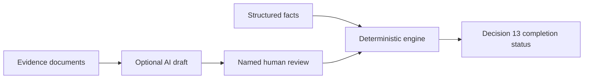

<div align="center">

# FTA13 Verification Engine

### A reproducible UAE VAT supplier and supply verification workflow

Turn FTA Decision No. 13 of 2026 into an explainable threshold assessment, guided checklist and downloadable verification record.

[](https://www.python.org/)
[](tests/test_engine.py)
[](.github/workflows/ci.yml)
[](LICENSE)

[**Launch the live tester**](https://fta13-uae-input-tax-verification.streamlit.app/) · [Try locally](#quick-start) · [Worked example](#worked-example) · [Developer guide](docs/DEVELOPER.md) · [Official Arabic decision](https://tax.gov.ae/ar/Legislation.aspx)

</div>

---

## Why this exists

From **1 October 2026**, UAE taxable persons must apply specified verification measures to suppliers and taxable supplies before deducting input tax.

The thresholds interact in ways that are easy to miss:

| Rule | Effect |
|---|---|
| Supply below **AED 10,000** | Article 6(1) exception may be available |
| Supplier spend above **AED 100,000** trailing or expected | The AED 10,000 exception is withdrawn |
| Supplier spend above **AED 375,000** trailing or expected | Enhanced supplier checks apply |

This means an invoice for **AED 2,400** can still require the full supply-verification workflow when that supplier is already above, or expected to exceed, the AED 100,000 ceiling.

## What the engine does

- Calculates the AED 10,000, AED 100,000 and AED 375,000 thresholds using exact `Decimal` arithmetic.
- Applies rolling trailing and forward-looking 12-month tests.
- Selects the supplier and supply clauses applicable to the scenario.
- Checks retained evidence and expiry dates.
- Routes judgment clauses to a named human reviewer.
- Produces a flat, explainable record for a verification register.
- Exports a readable assessment, CSV register and machine-readable JSON record.
- Surfaces open legal or policy questions instead of silently deciding them.

## A deliberate control boundary



Thresholds, evidence existence and completion status are deterministic. The optional AI layer may draft an assessment for judgment-heavy clauses, but it cannot change a result. A named human must explicitly accept or override the draft.

That boundary supports Article 5(3): the retained record must enable the Authority to verify how the procedures were implemented.

## Worked example

```text
Supply value, excluding VAT       AED   2,400
Trailing supplier spend           AED 480,000
Expected forward spend            AED 600,000

Article 6(1) invoice threshold     Below AED 10,000
Article 6(2) supplier ceiling      Exceeded
Article 3(4) enhanced checks       Required

Decision 13 verification          Required
```

The engine then returns the applicable Article 4 checks and identifies missing evidence or human conclusions. It does **not** declare that input tax is recoverable under the VAT Law as a whole.

## Quick start

### Use it online

Open the [live FTA13 readiness and verification tool](https://fta13-uae-input-tax-verification.streamlit.app/). Complete the scenario, supplier checks and supply checks, then download the review record. No installation, document upload or API key is required.

### Run the scenario tester

```bash
git clone https://github.com/Chezhira/fta13-uae-input-tax-verification.git
cd fta13-uae-input-tax-verification
python -m venv .venv

# Windows
.venv\Scripts\activate

# macOS / Linux
source .venv/bin/activate

pip install -r requirements.txt
streamlit run app.py
```

### Run the engine and tests

```bash
pip install -e ".[dev]"
python demo.py
python -m pytest -q
```

The core engine has no runtime dependencies. Streamlit is needed only for the browser-based tester, and Anthropic is optional for advisory drafting.

## Project map

| Path | Purpose |
|---|---|
| `fta13/thresholds.py` | Thresholds and rolling-period calculations |
| `fta13/clauses.py` | Decision requirements expressed as a clause registry |
| `fta13/engine.py` | Deterministic supplier and supply evaluation |
| `fta13/ai.py` | Optional, non-binding advisory drafting |
| `app.py` | Public Streamlit scenario tester |
| `demo.py` | End-to-end worked example |
| `tests/` | Boundary, evidence and control tests |
| `docs/DEVELOPER.md` | Integration and extension guide |
| `docs/legal-sources/` | Authoritative Arabic Decision and reconciliation record |

## Interpretations made explicit

- “Less than AED 10,000” and “exceeds” are implemented as strict comparisons.
- The rolling period is implemented as twelve calendar months.
- Forward expected spend can trigger controls at onboarding, before any invoice is received.
- A triggered Article 3(3) risk indicator requires the documented explanation specified in Article 3(3)(b).
- Potential retrospective exposure is surfaced for human review; the engine does not invent an answer the Decision does not state.

## Legal source and scope

The implementation has been reconciled to the authoritative Arabic Decision. The FTA's unofficial English translation is used for English-language labels and descriptions:

- [Authoritative Arabic Decision retained in this repository](docs/legal-sources/FTA-Decision-13-2026-Arabic.pdf)
- [Arabic-to-implementation reconciliation](docs/legal-sources/RECONCILIATION.md)
- [FTA legislation library](https://tax.gov.ae/ar/Legislation.aspx). Search for **قرار الهيئة رقم (13) لسنة 2026**. The FTA listing records an issue date of 22 July 2026 and publication date of 20 August 2026.

If any discrepancy arises, the Arabic text prevails. This open-source project assesses completion of the verification measures in Decision No. 13 only. It does not determine overall input-tax recoverability, replace professional judgment or constitute tax advice.

---

<div align="center">

Built as a finance-engineering reference implementation. MIT licensed.

</div>
